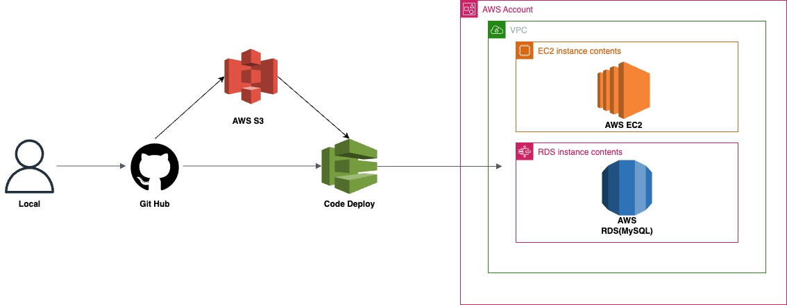
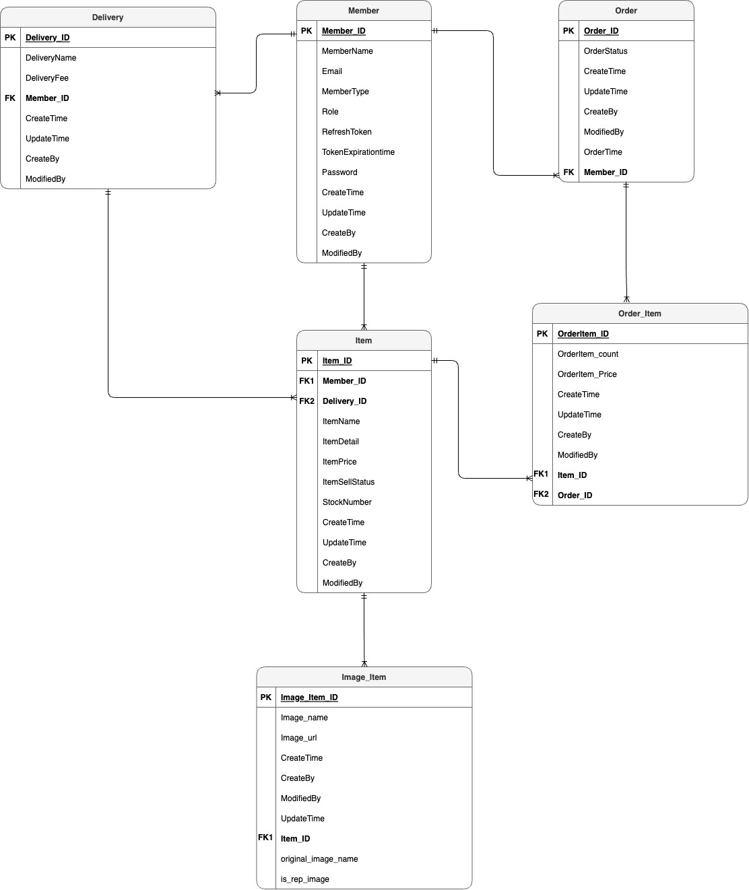

# 온라인 쇼핑몰

## Project Goal
* [무신사](https://www.musinsa.com/app/)과 [29cm](https://www.29cm.co.kr/home/) 참조하여 이커머스 서비스를 설계를 하고 서버를 구성했습니다.

* 이 프로젝트는 다음의 **목표**를 갖습니다.
  * 유지보수를 고려하여 객체지향 설계 바탕으로 개발을 진행하고, 테스트코드를 작성했습니다.
  * 배포 환경에 맞춰 AWS 아키텍처를 구성했습니다.
  * CI/CD 환경을 구축하여 빌드, 테스트, 배포를 자동화합니다.

## Architecture 

### ERD

## Coding Conventions
- [Coding Conventions](https://jihwanlog.vercel.app/docs/shop/rule)
## API Spec
- [API Spec](https://jihwanlog.vercel.app/api)

## Trouble Shooting
- **[Amazon Linux MYSQL 설치 오류를 해결하라](https://jihwanlog.vercel.app/blog/AWS/aws-linux-mysql/)**
- **[인증 할 수 없는 토큰 에러를 해결하라](https://jihwanlog.vercel.app/blog/2023/09/20/blog/token/)**
- **[로그인 시 findByEmail에서 ID가 조회가 안 되는 에러를 해결하라](https://jihwanlog.vercel.app/blog/2023/09/20/blog/soveld-email/)**
- **[이메일 중복 체크 에러를 해결하라](https://jihwanlog.vercel.app/blog/2023/09/20/blog/duplication-email/)**
- **[GitAction 속도 개선하기](https://jihwanlog.vercel.app/blog/CI/CD/git-action.cache/)**
- **[GitHub Action CI/CD 구현하기](https://jihwanlog.vercel.app/blog/CI/CD/git-action/)**
- **[GitAction Build 실패 에러를 해결하라](https://jihwanlog.vercel.app/blog/CI/CD/git-build-fail/)**
- **[테스트 코드에 Mock을 사용한 이유](https://jihwanlog.vercel.app/blog/posting/reson-mock)**
- **[ORM 대신 MYSQL로 개발한 이유](https://jihwanlog.vercel.app/blog/posting/orm)**

자세한 내용을 확인 하고 싶으시면, ▶️ [Wiki Documentation](https://jihwanlog.vercel.app/blog)를 참조 하시면 됩니다.

## Reference
- https://www.musinsa.com/app/
- https://kream.co.kr/
- https://www.29cm.co.kr/home/
